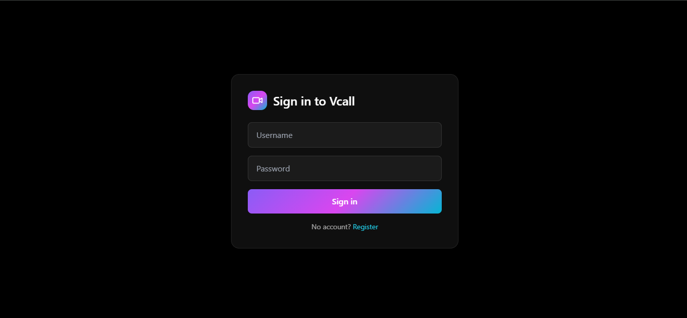
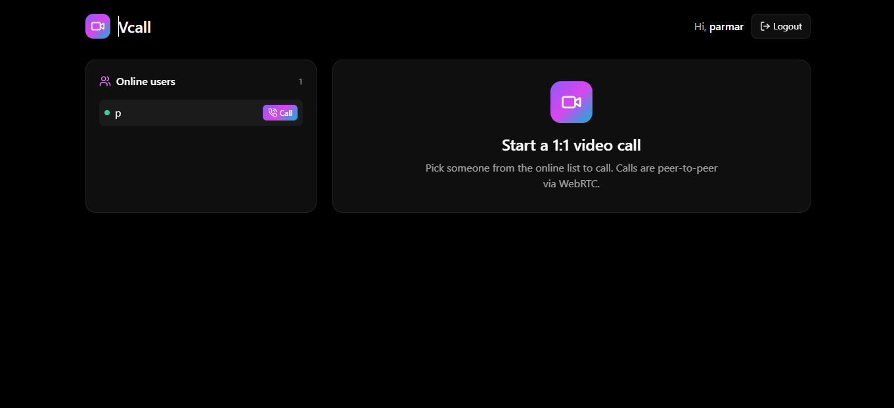
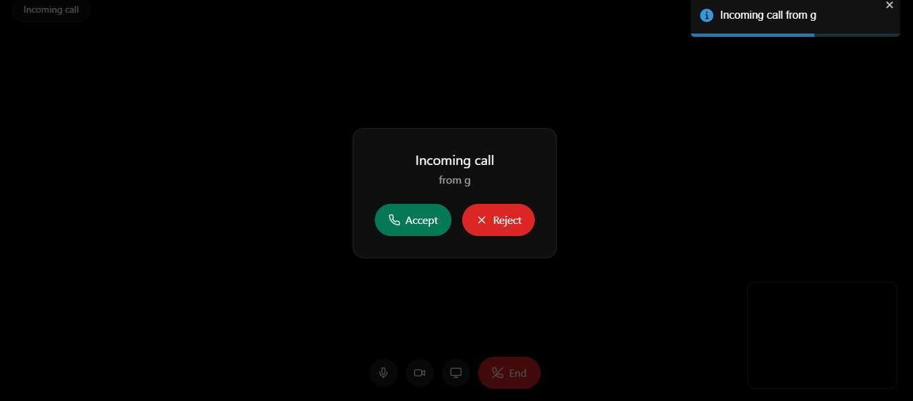
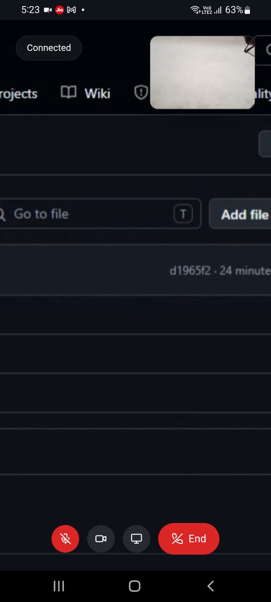

# Vcall

<div align="center">


<br/>

[](https://vcall-drab.vercel.app/)
[](https://github.com/vansh1011/vcall)


<br/>


<br/>

> **A full-stack, production-deployed peer-to-peer video calling app built completely from scratch.**
> Real-time video communication powered by raw WebRTC and Socket.io — without third-party video SDKs.

</div>

---

# Overview

Vcall is a real-time peer-to-peer video calling application built using raw WebRTC and Socket.io signaling. The project focuses on understanding low-level realtime communication architecture rather than relying on third-party video platforms.

The application supports direct browser-to-browser audio/video streaming, authentication, screen sharing, live online presence, and responsive media controls while handling real-world deployment challenges in production.

---

# Preview


## Login screen


## Home Screen


## Call Accept/Reject


## Mobile screen sharing



# What Makes This Project Stand Out

* Built using **raw WebRTC APIs** without Zoom, Agora, Twilio, or other video SDKs
* Implemented complete **Socket.io signaling architecture** from scratch
* Integrated secure authentication using **Passport.js + bcrypt + PostgreSQL sessions**
* Solved a real production deployment issue involving **WebSocket proxy limitations on Vercel**
* Implemented **screen sharing with seamless camera restoration** using live track replacement
* Handled **ICE candidate timing issues** with a pending candidate queue
* Deployed full-stack architecture using **Vercel + Render + Neon PostgreSQL**

---

# Features

|     | Feature                   | Details                                              |
| --- | ------------------------- | ---------------------------------------------------- |
| 🎥  | **1-on-1 Video Calling**  | Direct P2P communication using `RTCPeerConnection`   |
| 👥  | **Live Online Presence**  | Realtime online users powered by Socket.io           |
| 🖥️ | **Screen Sharing**        | Replace live camera stream without dropping the call |
| 🎙️ | **Media Controls**        | Toggle microphone and camera during calls            |
| 🔐  | **Authentication System** | Register/login with bcrypt + Passport.js             |
| 💾  | **Persistent Sessions**   | PostgreSQL-backed session storage                    |
| 📱  | **Responsive Design**     | Optimized layout for desktop and mobile devices      |
| ⚡   | **Realtime Signaling**    | Offer/answer and ICE exchange using Socket.io        |
| 🔔  | **Call Notifications**    | Incoming call alerts, rejections, and hangups        |

---

# Architecture

```txt
┌──────────────────────────────────────────────────────────────┐
│                       BROWSER  (User A)                      │
│         React  ·  WebRTC  ·  Socket.io-client                │
└──────────────┬───────────────────────┬───────────────────────┘
               │  REST  (HTTPS)        │  Socket.io  (WSS)
               ▼                       ▼
┌──────────────────────────────────────────────────────────────┐
│              Render Backend  (Node.js + Express)             │
│                                                              │
│   ┌──────────────┐   ┌───────────────┐   ┌───────────────┐  │
│   │ Passport.js  │   │   Socket.io   │   │ Neon Postgres │  │
│   │ Auth + API   │   │   Signaling   │   │   Sessions    │  │
│   └──────────────┘   └───────────────┘   └───────────────┘  │
└──────────────────────────────────────────────────────────────┘
               │   Offer / Answer / ICE  (signaling only)
               ▼
┌──────────────────────────────────────────────────────────────┐
│                       BROWSER  (User B)                      │
│         React  ·  WebRTC  ·  Socket.io-client                │
└──────────────────────────┬───────────────────────────────────┘
                           │
          ◄════════════════╧═══════════════════►
              Direct P2P WebRTC Stream
              (audio/video bypasses server entirely)
```

---

# WebRTC Signaling Flow

```txt
User A                  Socket.io Server                 User B
  │                           │                             │
  │── register("alice") ─────►│                             │
  │                           │◄──── register("bob") ───────│
  │◄── online-users({...}) ───┼──── online-users({...}) ───►│
  │                           │                             │
  │── offer (SDP) ───────────►│──────── offer (SDP) ───────►│
  │◄─────────── answer (SDP) ─│◄──────── answer (SDP) ──────│
  │── ICE candidate ─────────►│──────── ICE candidate ─────►│
  │◄─────────── ICE candidate─│◄──────── ICE candidate ─────│
  │                           │                             │
  │◄════════════ Direct P2P Video/Audio ═══════════════════►│
```

---

# Networking

WebRTC peers use STUN servers to discover public network addresses and establish direct peer-to-peer connections.

Current configuration:

```js
const peerConnection = new RTCPeerConnection({
  iceServers: [
    {
      urls: "stun:stun.l.google.com:19302"
    }
  ]
});
```

Currently the project uses public STUN servers only. TURN servers are not configured yet, so connectivity may fail on highly restrictive networks.

---

# Tech Stack

| Layer               | Technology                         | Purpose                          |
| ------------------- | ---------------------------------- | -------------------------------- |
| **Frontend**        | React 18, React Router v6          | Single-page application          |
| **Styling**         | Tailwind CSS, Lucide Icons         | Responsive UI                    |
| **Realtime**        | Socket.io                          | Bidirectional realtime signaling |
| **Video/Audio**     | WebRTC `RTCPeerConnection`         | Native browser P2P communication |
| **Backend**         | Node.js, Express                   | REST API + signaling server      |
| **Auth**            | Passport.js, bcrypt                | Secure authentication            |
| **Sessions**        | express-session, connect-pg-simple | Persistent sessions              |
| **Database**        | Neon PostgreSQL                    | User and session storage         |
| **Frontend Deploy** | Vercel                             | Frontend hosting                 |
| **Backend Deploy**  | Render                             | Node.js backend hosting          |

---

# Running Locally

## Prerequisites

* Node.js v18+
* PostgreSQL

---

## 1. Clone Repository

```bash
git clone https://github.com/vansh1011/vcall.git
cd vcall
```

---

## 2. Backend Setup

```bash
cd backend
npm install
```

Create `backend/.env`:

```env
PORT=8000
NODE_ENV=development
DATABASE_URL=your_database_connection_string
SECRET=your_session_secret
FRONTURL=http://localhost:5173
```

Create required tables:

```sql
CREATE TABLE reg (
  id SERIAL PRIMARY KEY,
  username VARCHAR(50) UNIQUE NOT NULL,
  password TEXT NOT NULL
);

CREATE TABLE session (
  sid VARCHAR PRIMARY KEY,
  sess JSON NOT NULL,
  expire TIMESTAMP(6) NOT NULL
);
```

Start backend:

```bash
npm start
```

---

## 3. Frontend Setup

```bash
cd frontend
npm install
```

Create `frontend/.env`:

```env
VITE_API_URL=http://localhost:8000
```

Run frontend:

```bash
npm run dev
```

Open:

```txt
http://localhost:5173
```

Register two accounts in separate tabs and start a call.

---

# Production Deployment

## Backend → Render

1. Create a new Web Service on Render
2. Configure environment variables:

```env
DATABASE_URL=your_database_url
SECRET=your_secret
FRONTURL=https://your-app.vercel.app
NODE_ENV=production
```

---

## Frontend → Vercel

1. Import frontend repository into Vercel
2. Configure environment variable:

```env
VITE_API_URL=your_backend_url
```

3. Add `vercel.json`:

```json
{
  "rewrites": [
    {
      "source": "/api/:path*",
      "destination": "https://your-backend-url/:path*"
    }
  ]
}
```

---

# Technical Challenges Solved

## WebSocket Proxying on Vercel

Vercel serverless rewrites do not properly support HTTP → WebSocket upgrades. REST APIs worked correctly through rewrites, but Socket.io connections silently failed.

Solution:

* REST requests continue through the Vercel proxy
* Socket.io connects directly to the backend origin

This separation solved realtime connection instability in production.

---

## Screen Sharing Without Dropping Calls

Implemented live media track replacement using:

```js
RTCRtpSender.replaceTrack()
```

This allows switching between camera and screen share without renegotiating the entire peer connection.

---

## ICE Candidate Race Condition

Remote ICE candidates may arrive before:

```js
setRemoteDescription()
```

is completed.

To prevent errors, candidates are temporarily stored inside a pending queue and flushed once the remote description becomes available.

---

## Persistent Sessions Across Restarts

Instead of storing sessions in memory, sessions are stored in PostgreSQL using:

```txt
connect-pg-simple
```

This prevents users from being logged out whenever the backend restarts.

---

# Why Raw WebRTC Instead of a Video SDK?

The primary goal of this project was to deeply understand realtime communication internals including:

* SDP negotiation
* ICE candidate exchange
* NAT traversal
* Peer connection lifecycle
* Realtime signaling architecture
* Media stream management

Using raw WebRTC APIs provided full control over the connection flow and exposed real-world networking and deployment challenges directly.

---

# Key Learnings

* Understanding WebRTC peer connection lifecycle deeply
* Handling asynchronous realtime communication reliably
* Debugging ICE candidate timing issues
* Managing media streams and live track replacement
* Deploying realtime applications in production environments
* Working with persistent session storage using PostgreSQL
* Understanding WebSocket deployment limitations on serverless platforms

---

# Project Structure

```txt
vcall/
├── backend/
│   ├── server.js        # REST API + Socket.io signaling server
│   ├── db.js            # PostgreSQL pool configuration
│   └── .env
│
└── frontend/
    ├── src/
    │   ├── pages/
    │   │   ├── Home.jsx
    │   │   ├── Call.jsx
    │   │   ├── Login.jsx
    │   │   └── Register.jsx
    │   ├── socket.js
    │   └── api.js
    ├── vercel.json
    └── .env
```

---

# Future Improvements

* Group video calling
* TURN server integration
* In-call chat messaging
* File sharing
* Call recording
* Better reconnection handling
* End-to-end encryption enhancements

---

# Environment Variable Examples

## backend/.env.example

```env
PORT=8000
NODE_ENV=development
DATABASE_URL=your_database_url
SECRET=your_secret
FRONTURL=http://localhost:5173
```

## frontend/.env.example

```env
VITE_API_URL=http://localhost:8000
```


# Author

**Vansh**

* GitHub: [https://github.com/vansh1011](https://github.com/vansh1011)
* Project: [https://github.com/vansh1011/vcall](https://github.com/vansh1011/vcall)
* Live Demo: [https://vcall-drab.vercel.app/](https://vcall-drab.vercel.app/)
